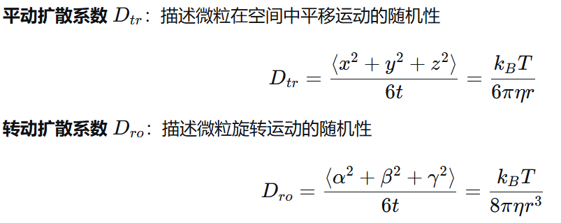
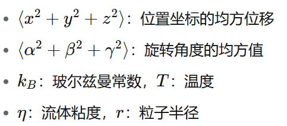
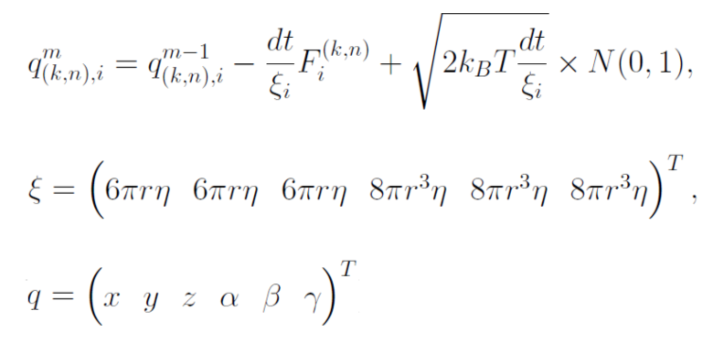

来自：https://github.com/vexing-shusher/microtubule-dynamics-simulation

---

测试项目环境是否配置成功，通过一个简单的 try 文件

```
cd ./try
g++ ./try.cpp -o try.exe
./try.exe
输出 Hello world!
```

- 如果使用 CLion 的话，只需要点 Run 就好，会自动生成 `try.exe`

---

## 输入输出

要求用户输入的 2 个参数：

1. 迭代次数，即时间步，要观察微观在几个时间步内的变化
2. 文件名，即观测内容的保存路径。建议后缀为 `csv`

### 文件解释

初始微管位置文件是：`init_coord.csv`
它的第一列是 Qij，i 的取值范围是 1到13（因为有 13 个原纤维），j 的取值范围是 1到 6（其中Q1,Q2,Q3：三维空间坐标表示x,y,z，Q4,Q5,Q6：三维空间中的旋转角度，欧拉角或四元数表示方向）

## 原理介绍

微管是由 **`α-微管蛋白`和 `β-微管蛋白`二聚体**组成的中空圆柱状细胞骨架，直径22-25nm，**管壁含13条原纤维**

像一个玉米，有 13 纵列，每一个玉米粒是  **α/β-微管蛋白二聚体，它由”** α-微管蛋白"亚基 和 **”** β-微管蛋白"亚基 构成

### 微管的四个层面结构：

- 微管
- 原纤维（ 13 条）
- 蛋白二聚体
- 蛋白亚基（α-微管蛋白亚基 和 β-微管蛋白亚基）
- 原子。蛋白亚基是由成千上万个原子通过化学键构建而成的独立的三维结构单元。而原子是构成这些亚基，乃至一切物质的基本物理粒子。

### Microtubule properties  微管特性

- Dynamic instability  动态不稳定性
- Polarity of the ends 端极性
- Ability to generate force 产生力的能力
- Aging  老化

### 为什么原纤维横截面有4个亚基？

在一条原纤维的内部，二聚体是以一种**错位堆叠**的方式纵向排列的。原纤维是由两层纵向排列的微管蛋白亚基**交错形成**的，而不是由一长串二聚体**简单头尾相连**形成的单排链。

_为4是很确定的事情吗，有没有可能为3 或者 5？_

基于实验证明基本就是4，3或5只可能出现在非标准结果的微管里

## 核心任务：构建微管动态行为的计算机模拟模型

**该程序在用计算机模拟微管的动态变化过程** ，微观具有动态不稳定性，会自发伸长、缩短，该程序通过代码复现此过程

1. **模拟微管的结构** ：用三维坐标描述微管的 13 根原纤维（每根含 4 个蛋白亚基）的空间位置；
2. **模拟时间演化** ：通过迭代计算（代码中的 `for` 循环），更新每个蛋白亚基的位置和角度，模拟微管随时间的变化；
3. **考虑相互作用** ：通过 `evaluate`、`ev_seam_0` 等函数，引入蛋白亚基之间的力学作用（如 GTP/GDP 结合状态的差异、侧向相互作用），让模拟更接近真实生物过程。

### 1. 验证基础物理模型的合理性

* **实验 1（布朗运动验证）** ：代码通过模拟验证微管的运动是否符合爱因斯坦的布朗运动公式（位移方差与时间成线性关系），确保模型的物理基础正确。
* 这也是为什么代码中会跟踪每个亚基的坐标变化（`Q1-Q6` 包含位置和角度），并计算其随时间的演化。

### 2. 研究微管的动态行为机制

* **实验 2-4（四聚体动态）** ：聚焦由 4 个蛋白亚基组成的 “四聚体”（微管的基本结构单元），模拟两种状态（全 GTP 结合 / 部分 GDP 结合）和两种边界条件（自由浮动 / 底部固定）下的行为，探索：
* 微管蛋白在不同核苷酸结合状态（GTP→GDP 水解）下的结构变化；
* 侧向相互作用（原纤维之间的连接）对微管稳定性的影响；
* 微管弯曲、伸长等构象变化的规律（代码中 `coord` 的更新正是在计算这些变化）。


## 实验1

测试仿真系统中的微管在理想状态下的运行是否符合**爱因斯坦的布朗运动理论，即"斯托克斯–爱因斯坦关系式"[(the stokes-einstein relation)](https://www.dalalinstitute.com/wp-content/uploads/Books/A-Textbook-of-Physical-Chemistry-Volume-1/ATOPCV1-8-5-The-Stokes-Einstein-Relation.pdf)**

### 理论解释

该理论从普遍的粒子运动中抽象中了 2 个系数

其中：t 是观测时间间隔，即测量粒子位移所经过的实际物理时间。即仿真系统中的模拟步长



### 实验方法

- 让微管在理想状态下随机运动，并记录每一个蛋白亚基的位置变化
- 计算系统中粒子的真实扩散系数
- 与爱因斯坦测量出的理论值进行对比

### 实验结果

- thr 是 theoretical（理论的） 的缩写
- time 是每个模拟步长所代表的物理时间
- Dtr 和 Dro 是真实计算出的仿真系统 **扩散系数**
  

## 实验2-3



## 随机性

1. 初始坐标一定是随机的
